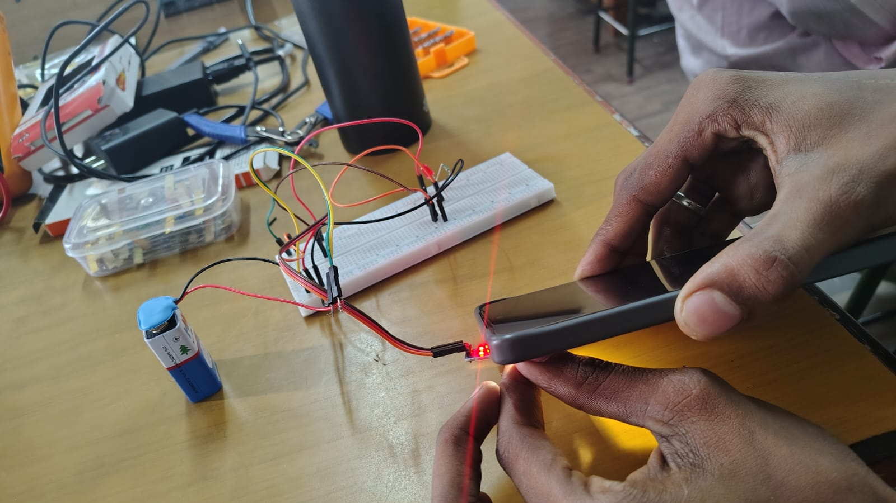

# **Documentation – Automatic Night Light**

### **1\. Project Name**

**Automatic Night Light Using LDR**

### **2\. Aim**

To automatically turn an LED **ON in darkness** and **OFF in light**.

### **3\. Components**

* 9V Battery  
* LDR  
* LED  
* Resistor  
* NPN Transistor  
* Breadboard & Connecting Wires

### **4\. Working**

The **LDR senses the surrounding light**. In darkness, the transistor switches ON and the LED glows. In bright light, the LED turns OFF.

### **5\. Applications**

* Automatic street lights  
* Night lamps  
* Security lighting  
* Energy-saving lighting systems

### **6\. Safety**

* Check the polarity of the LED and battery.  
* Use the correct resistor with the LED.  
* Avoid short-circuiting the battery.

# **7.Circuit and Result**

